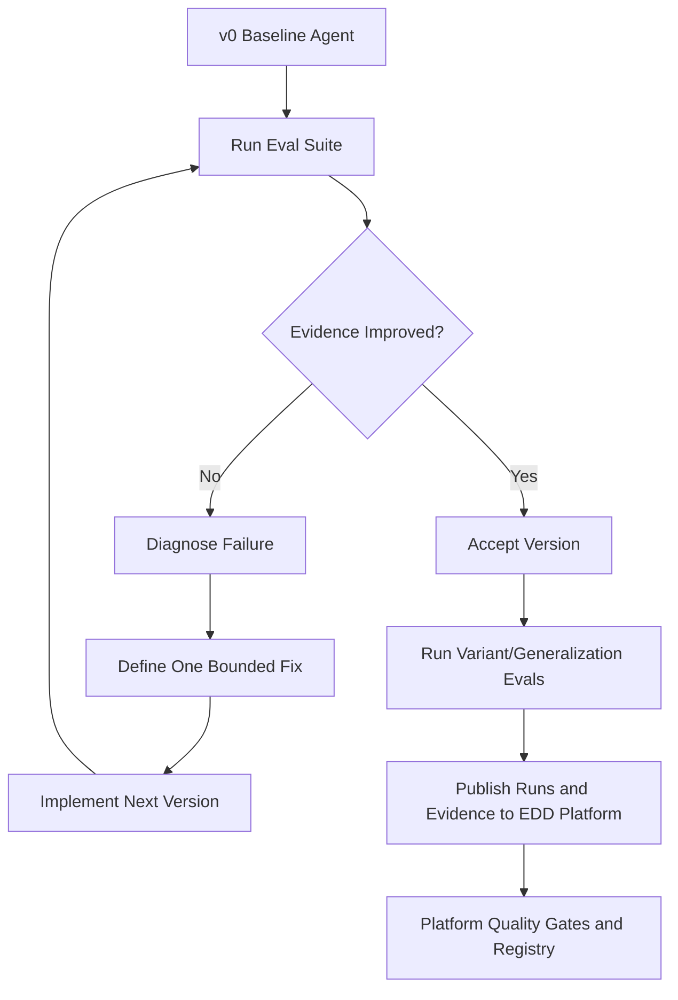
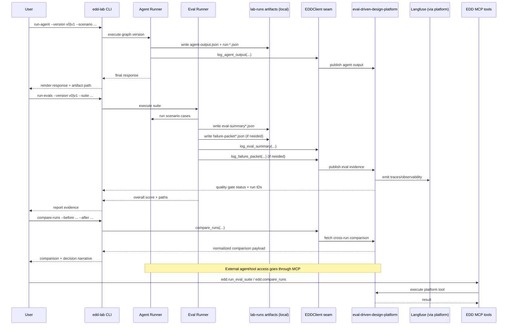

# EDD Agent Lab

EDD Agent Lab demonstrates how LangGraph agents evolve through **evaluation-driven design**.

Most agent demos show the final polished behavior. This lab shows the engineering loop: baseline behavior, eval failures, trace evidence, diagnosis, bounded fixes, and verification runs.

## What This Repo Shows

- A LangGraph-based **Customer Solution Discovery** agent
- Evaluation suites for discovery quality, measurable value, risk review, tool use, and overfitting
- Versioned **lab runs** under `lab-runs/` with diagnoses, fix plans, and eval summaries
- Optional integration with the [eval-driven-design-platform](https://github.com/) (later milestones)

## Core Principle

**An agent improvement is not accepted until eval evidence improves.**

## EDD Loop at a Glance



## Target End-State Sequence (Final Milestone)



## Repo Structure

```text
edd-agent-lab/
  src/edd_agent_lab/          # Python package (CLI, loaders, agents)
  scenarios/                  # YAML customer scenarios
  evals/                      # YAML eval suites
  lab-runs/                   # Versioned run artifacts and narratives
  docs/                       # Story, EDD principles, integration notes
  tests/                      # pytest
  scripts/                    # CLI wrappers (prefer edd-lab)
```

## Quick Start

```bash
cd edd-agent-lab
python -m venv .venv
source .venv/bin/activate   # Windows: .venv\Scripts\activate
pip install -e ".[dev,agent]"

edd-lab --help
edd-lab list-scenarios --agent customer-solution
edd-lab list-evals --agent customer-solution
edd-lab run-agent --agent customer-solution --version v0 --scenario healthcare_documentation
edd-lab run-evals --agent customer-solution --version v0 --suite discovery_quality
pytest
```

Copy `.env.example` to `.env` when you add LLM-backed evals (Milestone 3+).

## Agent Evolution

| Version | Change | Main failure addressed | Evidence |
|---|---|---|---|
| v0 | Naive prompt agent | Generic solutioning | Discovery score low |
| v1 | Discovery-first graph | Missing process discipline | Discovery score improves |
| v2 | Overfitting evals | Brittle domain behavior | Variant pass rate exposed |
| v3 | Competency model | Weak generalization | Variant pass rate improves |
| v4 | Tool-enhanced graph | Reusable workflows | Better eval and planning consistency |

Lab artifacts: `lab-runs/customer_solution_agent/v0-baseline/` … `v4-tool-enhanced/`.

## EDD Platform Integration

```text
eval-driven-design-platform  = reusable evaluation infrastructure
edd-agent-lab                  = LangGraph agents improved with that infrastructure

edd-agent-lab  --->  eval-driven-design-platform
```

The platform must not depend on this repo. See `docs/05-platform-integration.md`.

## Roadmap

| Milestone | Status |
|---|---|
| 1 — Repo skeleton, CLI, loaders, tests | Complete |
| 2 — v0 LangGraph agent + `run-agent` | Complete |
| 3 — Eval runner + `run-evals` | Complete |
| 4 — v1 discovery graph | Complete |
| 5 — Overfitting eval | Next |
| 6 — v3 competency model | Planned |
| 7 — EDD platform client | Planned |
| 8 — MCP integration | Planned |

## Design Principles

1. Evals define what good behavior means.
2. Traces explain how behavior happened.
3. Fixes must be bounded.
4. Improvements require verification.
5. Passing one demo is not generalization.
6. Overfitting evals test whether behavior survives nearby variations.
7. The platform owns reusable evaluation infrastructure.
8. The lab owns concrete agent experiments.

## License

Add a license file before public release if needed.
