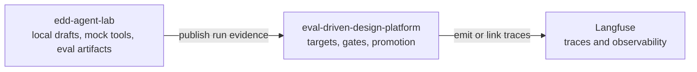
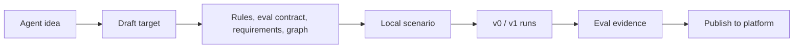

# EDD Agent Lab

Local agent workshop for the Evaluation-Driven Design stack.

This repo is the runnable companion to
[eval-driven-design-platform](https://github.com/bfalkowski/eval-driven-design-platform).
The lab owns local agent drafts, deterministic runs, mock tools, eval evidence,
and publishable artifacts. The platform repo owns canonical workflow state,
gates, promotion, and the Langfuse integration boundary.

```text
edd-agent-lab  ->  eval-driven-design-platform  ->  Langfuse
```

The dependency direction is intentional: the lab publishes evidence to the
platform; it does not import platform code or send traces directly to Langfuse.



## What This App Does

EDD Agent Lab helps turn an agent idea into local EDD artifacts:

- draft target
- behavior rules
- eval contract
- information and tool requirements
- graph design
- scenario
- v0 and v1 runs
- eval summaries
- comparison evidence

The local builder stores draft artifacts under `lab-runs/<agent_key>/draft/`.
Those files are reviewable and editable in the app.



## Run The Builder

Install Python dependencies:

```bash
uv venv --python 3.12
uv sync --extra dev --extra agent --extra platform --extra web
```

Install the React builder dependencies:

```bash
cd web/agent-builder
npm install
```

Start the local API:

```bash
uv run --extra web uvicorn edd_agent_lab.api.builder:app --host 127.0.0.1 --port 8002
```

Start the React builder:

```bash
cd web/agent-builder
npm run dev
```

Open:

```text
http://localhost:5173
```

The API runs at `http://127.0.0.1:8002`.

## Builder Workflow

1. Click `New agent`.
2. Enter an agent name and purpose.
3. Create the draft.
4. Select the draft from the project list.
5. Work through the steps in order.
6. Review or edit generated artifacts from each step.
7. Delete non-target artifacts when a step should be regenerated.
8. Compare versions and publish evidence when the platform is configured.

Draft projects can be deleted from the left project list. Deleting a project
removes its local `lab-runs/<agent_key>/` workspace.

## Local Artifacts

A draft workspace contains files like:

```text
lab-runs/<agent_key>/draft/
  agent-target.yaml
  behavior-rules.yaml
  eval-contract.yaml
  information-requirements.yaml
  tool-requirements.yaml
  graph-design.yaml
  scenario.yaml
  v0-run.yaml
  eval-summary.yaml
  failure-packet.yaml
  fix-plan.yaml
  graph-design-v1.yaml
  v1-run.yaml
  eval-summary-v1.yaml
  comparison.yaml
```

These are local draft artifacts. Platform persistence happens through the
publish integration, not by importing platform code.

## CLI Examples

Run the reference scenario:

```bash
edd-lab demo-escalation
```

List and run existing scenarios:

```bash
edd-lab list-scenarios --agent customer-solution
edd-lab run-agent \
  --agent customer-solution \
  --version v0 \
  --scenario healthcare_documentation
```

Run evals:

```bash
edd-lab run-evals \
  --agent customer-solution \
  --version v1 \
  --suite discovery_quality
```

Publish a run record to the platform API:

```bash
edd-lab publish-run \
  --agent customer-solution \
  --version v1-discovery-graph
```

## Platform Integration

The lab works standalone by default. To publish run evidence to the platform,
configure `.env`:

```bash
cp .env.example .env
```

Common platform settings:

```text
EDD_CLIENT_MODE=http
EDD_API_BASE_URL=http://127.0.0.1:8000
EDD_TENANT_ID=tenant-a
EDD_EVAL_SPEC_ID=<platform eval spec uuid>
EDD_API_KEY=<jwt when platform auth is enabled>
```

Publish smoke test:

```bash
./scripts/test_platform_publish.sh
```

## Project Layout

```text
edd-agent-lab/
  src/edd_agent_lab/
    agents/          # LangGraph agents and runners
    api/             # local builder API
    cli/             # edd-lab CLI
    evals/           # eval execution and scoring helpers
    integrations/    # platform publish client
    scenarios/       # scenario loading helpers
    ui/              # local workspace store
  web/agent-builder/ # React builder
  scenarios/         # YAML scenario definitions
  evals/             # YAML eval suites
  lab-runs/          # local generated draft and run artifacts
  docs/              # design notes and integration docs
  tests/             # pytest
  scripts/           # helper scripts
```

## Development

Run tests and lint:

```bash
uv run pytest
uv run ruff check .
```

Build the React builder:

```bash
cd web/agent-builder
npm run build
```

CI and local tests must pass without model-provider credentials. Live model
generation is opt-in:

```bash
OPENAI_API_KEY=...
AGENT_GENERATION_MODE=live
```

Default behavior uses deterministic mock generation.

## Key Docs

- [Platform integration](docs/05-platform-integration.md)
- [Live generation](docs/08-live-agent-generation.md)
- [Current developer experience](docs/09-developer-experience-today.md)
- [Ideal developer experience](docs/10-ideal-developer-experience.md)
- [Functional application plan](docs/13-functional-application-plan.md)
- [React builder architecture](docs/14-react-builder-pivot.md)
- [Platform HLD-005 reference scenario](https://github.com/bfalkowski/eval-driven-design-platform/blob/main/docs/hld/HLD-005-reference-scenario-customer-escalation-triage.md)

## Design Principles

1. Define good behavior before accepting agent changes.
2. Keep local drafts and platform-canonical workflow state separate.
3. Make tool mode visible; mock/local tools do not imply production readiness.
4. Prefer deterministic local tests and mock tools unless live mode is explicit.
5. Publish evidence to the platform; let the platform own gates and promotion.
