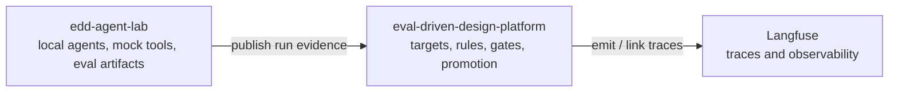
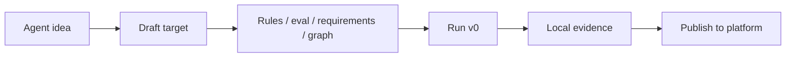

# EDD Agent Lab

Local agent workshop for the Evaluation-Driven Design stack.

This repo is the runnable companion to
[eval-driven-design-platform](https://github.com/bfalkowski/eval-driven-design-platform).
The lab owns local LangGraph agents, mock tools, run artifacts, eval runs, and the
developer workbench on `:8502`. The platform repo owns canonical design intent,
workflow state, gates, promotion, and the eventual Langfuse integration.

```text
edd-agent-lab  ->  eval-driven-design-platform  ->  Langfuse
```

The dependency direction is intentional. The lab publishes evidence to the platform;
it should not import platform code or send traces directly to Langfuse.



## Status

**Project status:** active prototype / workshop repo.

Current emphasis:

- local agent creation drafts in the lab console
- Customer Escalation Triage reference scenario
- v0/v1 comparison and local eval evidence
- platform publish seam via `POST /v1/integrations/runs/publish`

Not production-ready:

- greenfield agent creation is local YAML only
- draft agents do not save to platform Postgres yet
- generated tool bindings are placeholders until reviewed
- live model generation is optional and disabled in CI by default

## Repo Roles

| Repo / system | Owns |
|---|---|
| `edd-agent-lab` | Agent code, local scenarios, mock tools, eval suites, local run artifacts, `:8502` workbench |
| `eval-driven-design-platform` | Agent targets, behavior rules, eval contracts, gates, comparisons, promotion, readiness, platform API, `:8501` console |
| Langfuse | Trace and observability backend, integrated through the platform |

## What You Can Do Here

- Create a local draft agent target from a name and description.
- Scaffold draft EDD artifacts: behavior rules, eval contract, information requirements, tool requirements, and graph design.
- Add a first local test scenario and run a deterministic `v0-baseline`.
- Run the Customer Escalation Triage reference demo: v0 overclaims root cause, v1 checks evidence.
- Run local eval suites and write artifacts under `lab-runs/`.
- Publish local run records to the platform API when configured.



## Quick Start

```bash
cd edd-agent-lab
uv venv --python 3.12
uv sync --extra dev --extra agent --extra platform --extra ui
source .venv/bin/activate

edd-lab --help
edd-lab console
```

Open the lab console:

```text
http://localhost:8502
```

The platform console, when running from the companion repo, is usually:

```text
http://localhost:8501
```

## Lab Console (`:8502`)

The lab console has two primary modes.

### Start New Agent

Use this for a local greenfield draft.

Current flow:

1. Enter agent name and purpose.
2. Save `agent-target.yaml` under `lab-runs/<agent_key>/draft/`.
3. Scaffold draft design artifacts.
4. Enter a first local test scenario.
5. Run deterministic `v0-baseline`.

Generated local files:

```text
lab-runs/<agent_key>/draft/
  agent-target.yaml
  behavior-rules.yaml
  eval-contract.yaml
  information-requirements.yaml
  tool-requirements.yaml
  graph-design.yaml
  scenario.yaml
  v0-run.yaml
  run-record.json
```

These drafts are local artifacts. They do not write to platform Postgres yet.

### Reference Demo

Use this for the canonical side-by-side workbench from
[docs/12-lab-console-design.md](docs/12-lab-console-design.md).

Reference scenario:

- Agent: Customer Escalation Triage
- Scenario: Apex Health latency and quality regression
- `v0-baseline`: guesses and overclaims root cause
- `v1-evidence-triage-graph`: separates facts, hypotheses, and unknowns
- Outcome: behavior passes for demo; production readiness is blocked by mock/local tools

Run from CLI:

```bash
edd-lab demo-escalation
```

## CLI Examples

List and run existing scenarios:

```bash
edd-lab list-scenarios --agent customer-solution
edd-lab run-agent \
  --agent customer-solution \
  --version v0 \
  --scenario healthcare_documentation
```

Run evals:

```bash
edd-lab run-evals \
  --agent customer-solution \
  --version v1 \
  --suite discovery_quality
```

Publish a run record to the platform API:

```bash
edd-lab publish-run \
  --agent customer-solution \
  --version v1-discovery-graph
```

## Platform Integration

The lab works standalone by default. To publish to the platform, configure `.env`:

```bash
cp .env.example .env
```

Common platform settings:

```text
EDD_CLIENT_MODE=http
EDD_API_BASE_URL=http://127.0.0.1:8000
EDD_TENANT_ID=tenant-a
EDD_EVAL_SPEC_ID=<platform eval spec uuid>
EDD_API_KEY=<jwt when platform auth is enabled>
```

Then run:

```bash
edd-lab publish-run --agent customer-solution --version v1-discovery-graph
```

End-to-end publish smoke test:

```bash
./scripts/test_platform_publish.sh
```

## Project Layout

```text
edd-agent-lab/
  src/edd_agent_lab/
    agents/          # LangGraph agents and runners
    cli/             # edd-lab CLI
    evals/           # eval execution and scoring helpers
    integrations/    # platform publish seam and clients
    scenarios/       # scenario loading helpers
    ui/              # Streamlit lab console
  scenarios/         # YAML scenario definitions
  evals/             # YAML eval suites
  lab-runs/          # local generated run artifacts
  docs/              # local docs and workbench specs
  tests/             # pytest
  scripts/           # helper scripts
```

## Development

Run focused tests:

```bash
uv run pytest
uv run ruff check .
```

CI and tests must pass without model-provider credentials. Live LLM generation is
opt-in only:

```bash
OPENAI_API_KEY=...
AGENT_GENERATION_MODE=live
```

Default test behavior uses mock generation.

## Key Docs

- [Current developer experience](docs/09-developer-experience-today.md)
- [Ideal developer experience](docs/10-ideal-developer-experience.md)
- [Lab console design](docs/12-lab-console-design.md)
- [Platform integration](docs/05-platform-integration.md)
- [Live generation](docs/08-live-agent-generation.md)
- [Platform HLD-005 reference scenario](https://github.com/bfalkowski/eval-driven-design-platform/blob/main/docs/hld/HLD-005-reference-scenario-customer-escalation-triage.md)
- [Platform HLD-011 console IA](https://github.com/bfalkowski/eval-driven-design-platform/blob/main/docs/hld/HLD-011-console-information-architecture.md)

## Design Principles

1. Define what good behavior means before accepting agent changes.
2. Keep local drafts and platform-canonical workflow state separate.
3. Make tool mode visible; mock/local tools do not imply production readiness.
4. Prefer deterministic local tests and mock tools unless live mode is explicit.
5. Publish evidence to the platform; let the platform own gates and promotion.
