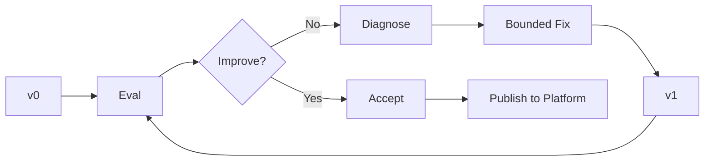
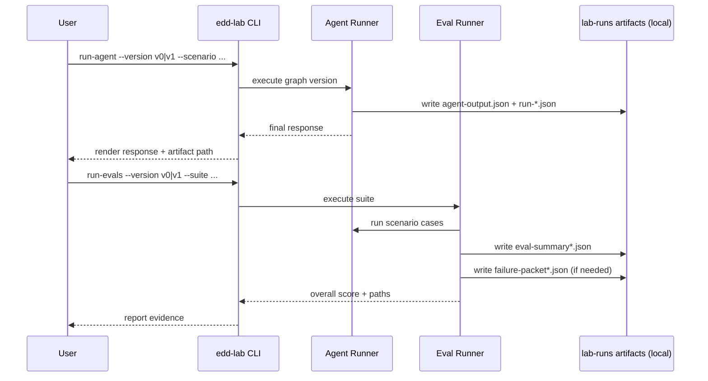
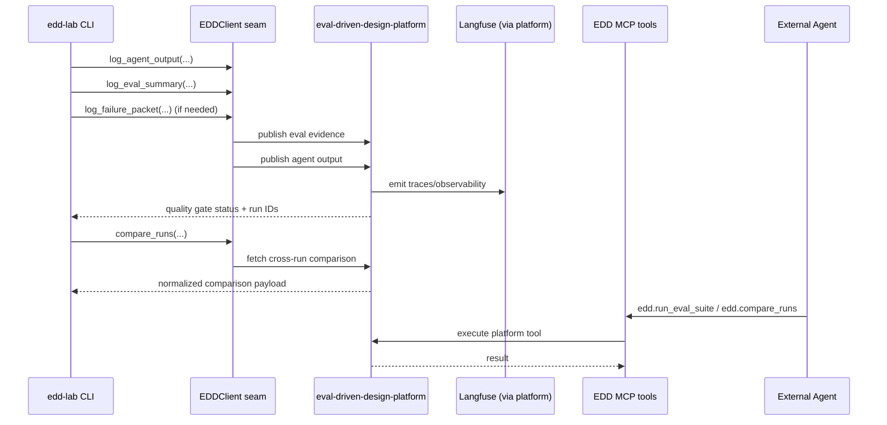
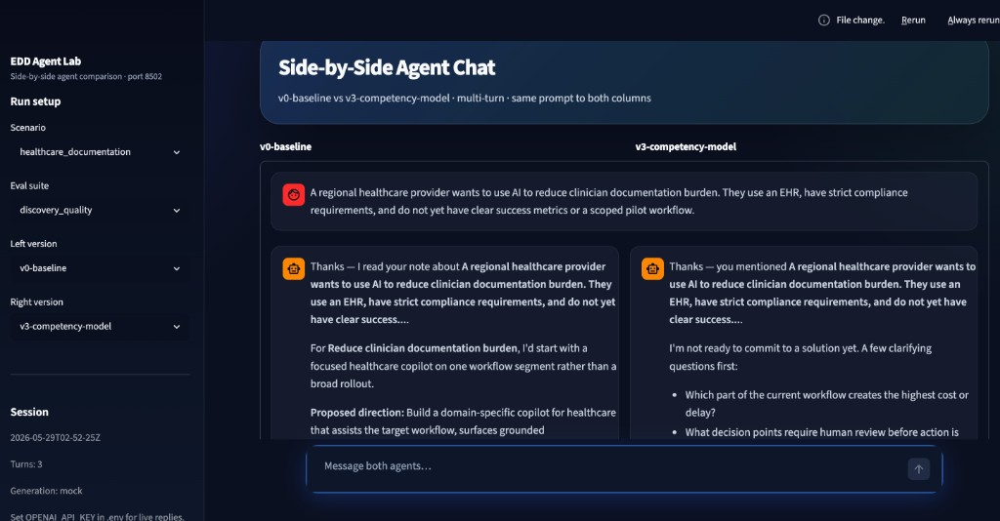

# EDD Agent Lab

**Repo:** [github.com/bfalkowski/edd-agent-lab](https://github.com/bfalkowski/edd-agent-lab) · **Platform:** [github.com/bfalkowski/eval-driven-design-platform](https://github.com/bfalkowski/eval-driven-design-platform)

EDD Agent Lab demonstrates how LangGraph agents evolve through **evaluation-driven design**.

Most agent demos show the final polished behavior. This lab shows the engineering loop: baseline behavior, eval failures, trace evidence, diagnosis, bounded fixes, and verification runs.

## How This Fits With the EDD Platform and Langfuse

EDD Agent Lab is not intended to replace the EDD platform or Langfuse. It is the agent development workshop that produces the evidence those systems organize and observe.

```text
edd-agent-lab
  runs LangGraph agents
  produces outputs, eval summaries, and failure packets
        |
        v
eval-driven-design-platform
  owns the EDD workflow:
  agent versions, failure packets, fix plans, verification gates,
  overfitting detection, run comparison, and MCP tools
        |
        v
Langfuse
  traces, scores, datasets, experiments, observability
```

In other words:

- **[edd-agent-lab](https://github.com/bfalkowski/edd-agent-lab)** is where agents are built and evolved.
- **[eval-driven-design-platform](https://github.com/bfalkowski/eval-driven-design-platform)** is where the evaluation-driven design process is managed.
- Langfuse is the observability and evaluation data plane.

The dependency direction should stay one-way:

```text
edd-agent-lab → eval-driven-design-platform → Langfuse
```

The lab should not talk directly to Langfuse. It publishes to the platform; the platform integrates with Langfuse.

## What This Repo Shows

- **Customer Solution Discovery** — initial LangGraph agent implementation (v0→v4 eval-driven iteration)
- **Customer Escalation Triage** — canonical reference agent ([HLD-005](https://github.com/bfalkowski/eval-driven-design-platform/blob/main/docs/hld/HLD-005-reference-scenario-customer-escalation-triage.md)): v0 overclaims root cause → v1 evidence-first graph
- Evaluation suites, versioned **lab runs** under `lab-runs/`, failure packets, and fix narratives
- Side-by-side **workbench** on `:8502` ([doc 12](docs/12-lab-console-design.md)) and CLI for run/eval/publish
- HTTP publish to **[eval-driven-design-platform](https://github.com/bfalkowski/eval-driven-design-platform)** (optional)

## Core Principle

**An agent improvement is not accepted until eval evidence improves.**

## EDD Loop at a Glance



## Target End-State Sequence (Final Milestone)

### 1) Agent + Eval Execution



### 2) Publish + Platform + MCP Path



## Repo Structure

```text
edd-agent-lab/
  src/edd_agent_lab/          # Python package (CLI, loaders, agents)
  scenarios/                  # YAML customer scenarios
  evals/                      # YAML eval suites
  lab-runs/                   # Versioned run artifacts and narratives
  docs/                       # Story, EDD principles, integration notes
  tests/                      # pytest
  scripts/                    # CLI wrappers (prefer edd-lab)
```

## Quick Start

```bash
cd edd-agent-lab
uv venv --python 3.12
uv sync --extra dev --extra agent --extra platform --extra ui
source .venv/bin/activate   # Windows: .venv\Scripts\activate

edd-lab --help

# Reference scenario (HLD-005) — primary workbench path
edd-lab demo-escalation
./scripts/demo_customer_escalation_triage.sh

# Customer Solution Discovery — initial agent implementation
edd-lab list-scenarios --agent customer-solution
edd-lab run-agent --agent customer-solution --version v0 --scenario healthcare_documentation
edd-lab run-evals --agent customer-solution --version v0 --suite discovery_quality
edd-lab publish-run --agent customer-solution --version v3

# Workbench UI
edd-lab console                  # http://localhost:8502
pytest
```

**Frontends (different ports):**

| UI | Repo | URL | Role |
|---|---|---|---|
| EDD platform console | [eval-driven-design-platform](https://github.com/bfalkowski/eval-driven-design-platform) | http://localhost:8501 | Design intent, gates, promotion |
| Agent lab workbench | [edd-agent-lab](https://github.com/bfalkowski/edd-agent-lab) | http://localhost:8502 | Run/compare v0 vs v1, publish evidence |

**Platform:** [HLD-011](https://github.com/bfalkowski/eval-driven-design-platform/blob/main/docs/hld/HLD-011-console-information-architecture.md) · **Lab workbench:** [12-lab-console-design.md](docs/12-lab-console-design.md)

### Reference workbench (`:8502`)

Launch with `uv sync --extra ui` then `edd-lab console`. Default view is the **Customer Escalation Triage** reference scenario — context bar, scenario summary, side-by-side **v0-baseline** vs **v1-evidence-triage-graph**, EDD verdict, and details tabs (Graph, Tools, Scores, Traces, Artifacts, Publish). Click **Compare** to run mock triage + eval without live LLM keys.

```bash
edd-lab console
# optional: EDD_API_BASE_URL=http://127.0.0.1:8000 EDD_EVAL_SPEC_ID=... for Publish tab
```

**Not in scope yet:** creating a new agent or scenario from the UI ([Phase 15](https://github.com/bfalkowski/eval-driven-design-platform/blob/main/docs/HLD_TEST_FIRST_IMPLEMENTATION.md#phase-15--greenfield-agent-entry-platform--lab)). New scenarios today: add YAML under `scenarios/` and agent code under `src/edd_agent_lab/agents/`.



Copy `.env.example` to `.env` and set `OPENAI_API_KEY` for live agent generation.

```bash
cp .env.example .env
# AGENT_GENERATION_MODE=auto uses live generation when OPENAI_API_KEY is set
edd-lab run-agent --agent customer-solution --version v1 --scenario healthcare_documentation --generation-mode live
```

## Agent Evolution

### Customer Solution Discovery (initial implementation)

| Version | Change | Main failure addressed | Evidence |
|---|---|---|---|
| v0 | Naive prompt agent | Generic solutioning | Discovery score low |
| v1 | Discovery-first graph | Missing process discipline | Discovery score improves |
| v2 | Overfitting evals | Brittle domain behavior | Variant pass rate exposed |
| v3 | Competency model | Weak generalization | Variant pass rate improves |
| v4 | Tool-enhanced graph | Reusable workflows | Better eval and planning consistency |

Artifacts: `lab-runs/customer_solution_agent/v0-baseline/` … `v4-tool-enhanced/`

### Customer Escalation Triage (reference — HLD-005)

| Version | Graph | Outcome |
|---|---|---|
| v0-baseline | Single-pass response | Fails `separate_facts_from_hypotheses`; overclaims root cause |
| v1-evidence-triage-graph | Evidence collection + facts/hypotheses/unknowns | Pass for demo; production blocked (mock/local tools) |

Lab artifacts: `lab-runs/customer_escalation_triage/` · platform design bundle: [examples/customer_escalation_triage](https://github.com/bfalkowski/eval-driven-design-platform/tree/main/examples/customer_escalation_triage)

## EDD Platform Integration

[eval-driven-design-platform](https://github.com/bfalkowski/eval-driven-design-platform) owns reusable evaluation infrastructure; this repo owns runnable agents and local evidence.

```text
edd-agent-lab  →  eval-driven-design-platform  →  Langfuse
```

The platform must not depend on this repo. See [docs/05-platform-integration.md](docs/05-platform-integration.md).

**Talk to the platform (optional):** lab works standalone by default. To publish runs over HTTP:

```bash
cp .env.example .env
# EDD_CLIENT_MODE=http
# EDD_API_BASE_URL=http://127.0.0.1:8000
# EDD_TENANT_ID=tenant-a
# EDD_EVAL_SPEC_ID=<uuid-from-platform-eval-spec>
# EDD_API_KEY=<jwt>   # required when platform APP_AUTH_ENABLED=true (default in local_e2e.sh)

edd-lab publish-run --agent customer-solution --version v1-discovery-graph
# success: Publish status: published_http
```

End-to-end smoke test (auto-mints JWT when platform repo is sibling):

```bash
./scripts/test_platform_publish.sh
```

## Roadmap

| Milestone | Status |
|---|---|
| 1–8 | Repo skeleton through MCP integration | Complete |
| 9 | Side-by-side console (`customer-solution`) | Complete |
| 10 | Live agent generation (mock/live/auto) | Complete |
| 11 | Customer Escalation Triage reference agent (HLD-005) | Complete |
| 12 | Doc 12 workbench on `:8502` | Complete |
| 13c | Gates/Promotion + validation script ([platform repo](https://github.com/bfalkowski/eval-driven-design-platform)) | Next |
| 15 | Greenfield agent/scenario entry | Planned |

See [HLD Test-First Implementation](https://github.com/bfalkowski/eval-driven-design-platform/blob/main/docs/HLD_TEST_FIRST_IMPLEMENTATION.md) for cross-repo phases. Live vs mock mode: `docs/08-live-agent-generation.md`.

**Developer experience:**

- [Current DX](docs/09-developer-experience-today.md) — how the lab + platform work today
- [Ideal DX](docs/10-ideal-developer-experience.md) — target EDD lifecycle and artifact model
- [Lab console design](docs/12-lab-console-design.md) — **canonical `:8502` workbench UX** (reference scenario)
- [Ideal console](docs/11-ideal-console-design.md) — target platform console workspaces and UX
- [HLD-001: Product intent](https://github.com/bfalkowski/eval-driven-design-platform/blob/main/docs/hld/HLD-001-product-intent-and-system-boundaries.md)
- [HLD-002: Domain model](https://github.com/bfalkowski/eval-driven-design-platform/blob/main/docs/hld/HLD-002-domain-object-model.md)
- [HLD-003: EDD workflow](https://github.com/bfalkowski/eval-driven-design-platform/blob/main/docs/hld/HLD-003-evaluation-driven-design-workflow.md)
- [HLD-004: Tool feasibility](https://github.com/bfalkowski/eval-driven-design-platform/blob/main/docs/hld/HLD-004-tool-requirements-and-feasibility.md)
- [HLD-005: Reference scenario](https://github.com/bfalkowski/eval-driven-design-platform/blob/main/docs/hld/HLD-005-reference-scenario-customer-escalation-triage.md)
- [HLD-006: MVP plan](https://github.com/bfalkowski/eval-driven-design-platform/blob/main/docs/hld/HLD-006-mvp-implementation-plan.md)
- [HLD-007: Platform API](https://github.com/bfalkowski/eval-driven-design-platform/blob/main/docs/hld/HLD-007-platform-api-and-integration.md)
- [HLD-008: Langfuse integration](https://github.com/bfalkowski/eval-driven-design-platform/blob/main/docs/hld/HLD-008-langfuse-integration.md)
- [HLD-009: Architecture diagrams](https://github.com/bfalkowski/eval-driven-design-platform/blob/main/docs/hld/HLD-009-architecture-and-flow-diagrams.md)
- [HLD-010: Graph design](https://github.com/bfalkowski/eval-driven-design-platform/blob/main/docs/hld/HLD-010-graph-design-and-rule-mapping.md)
- [HLD-011: Console IA](https://github.com/bfalkowski/eval-driven-design-platform/blob/main/docs/hld/HLD-011-console-information-architecture.md)
- [HLD-012: Versioning and promotion](https://github.com/bfalkowski/eval-driven-design-platform/blob/main/docs/hld/HLD-012-versioning-gates-and-promotion.md)

## Design Principles

1. Evals define what good behavior means.
2. Traces explain how behavior happened.
3. Fixes must be bounded.
4. Improvements require verification.
5. Passing one demo is not generalization.
6. Overfitting evals test whether behavior survives nearby variations.
7. The platform owns reusable evaluation infrastructure.
8. The lab owns concrete agent experiments.

## License

Add a license file before public release if needed.
