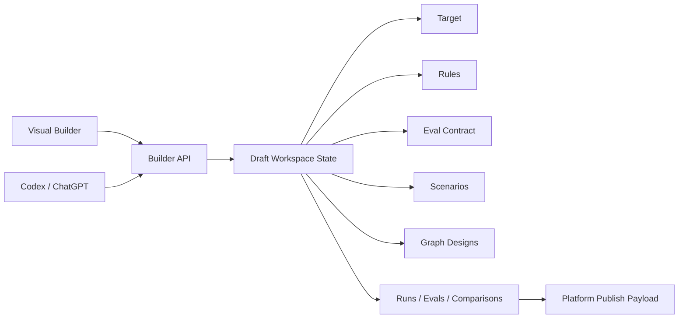
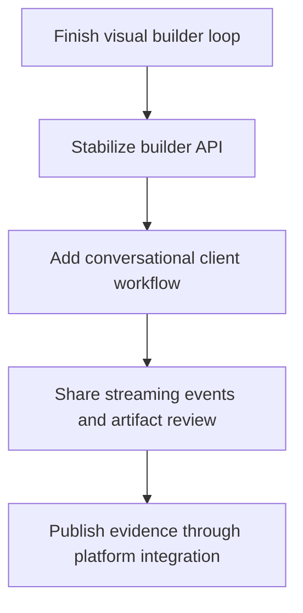

# Conversational Builder Workflow

## Status

Proposed future workflow.

## Context

The visual builder is the primary path for making the local EDD workflow clear:
create a draft agent, inspect artifacts, run versions, evaluate behavior,
compare candidates, and publish evidence.

A conversational workflow can be added after that foundation is stable. Codex or
ChatGPT should not replace the visual builder. It should act as another client
over the same local builder API and draft workspace state.

## Goal

Let a developer design agents through conversation while preserving the same EDD
artifacts, workflow steps, local runs, evaluations, comparisons, and publish
payloads used by the visual builder.

The conversational workflow should make fast authoring natural without hiding
the underlying evidence trail.

## Non-Goals

- Do not fork the product into a separate chat-only builder.
- Do not make Codex or ChatGPT the source of truth for project state.
- Do not bypass artifact validation, deterministic mock mode, or platform
  publish boundaries.
- Do not require model provider credentials for local tests or CI.

## Product Model

Both workflows operate on the same durable draft workspace.

The React app remains the inspection and control surface. The conversational
surface is the fast authoring and reasoning surface.

## Workflow

1. Developer starts in the visual builder or chat.
2. Developer describes an agent idea.
3. Conversational client calls the builder API to create or update a draft.
4. Builder generates target, rules, eval contract, information requirements,
   tool requirements, graph design, and scenarios.
5. Developer reviews generated artifacts in either chat or the visual builder.
6. Edits are applied through the same artifact update endpoints.
7. Runs and evaluations execute through the same deterministic local workflow.
8. Chat can summarize failures, propose bounded fixes, and request the next
   workflow action.
9. Visual builder shows the durable state, current step, generated artifacts,
   run output, eval results, and comparison evidence.

## Required Capabilities

- A stable builder API for every visual workflow action.
- Artifact read, edit, delete, and validation endpoints.
- Streaming workflow events that can be displayed in chat or in the visual UI.
- Clear provenance for generated, edited, evaluated, and published artifacts.
- Conversation-safe action boundaries: chat can propose changes, but the builder
  validates and writes state.
- Deterministic mock mode by default.
- Optional live model generation only when credentials are explicitly available.

## API Shape

The conversational client should use the same action model as the visual
builder:

- create draft
- update target
- generate design
- add or edit scenario
- run v0
- evaluate v0
- create fix plan
- generate v1 graph
- run v1
- evaluate v1
- compare versions
- inspect artifacts
- edit artifacts
- publish evidence

No separate chat-specific artifact format should be introduced.

## State And Provenance

Each write should preserve enough provenance to explain how an artifact changed:

- authoring surface: visual builder, Codex, ChatGPT, or API
- operation: generated, edited, deleted, evaluated, compared, or published
- source artifact or prior version when applicable
- timestamp
- workflow step

This can start as lightweight metadata in draft artifacts and later become a
proper event log if the product needs replay or audit views.

## Sequencing

Build this after the visual builder can complete the core local loop.

The visual builder should force the workflow to become explicit first. The
conversational workflow should then orchestrate that known workflow, not invent a
parallel one.

## Open Design Questions

- Should Codex operate directly on the local repository, through the builder API,
  or through both depending on the action?
- Should ChatGPT use a hosted connector, a local bridge, or exported prompt
  templates first?
- How much artifact editing should be free-form chat versus structured patch
  proposals?
- What provenance metadata is enough for a solo local workflow without adding
  heavy audit machinery?
